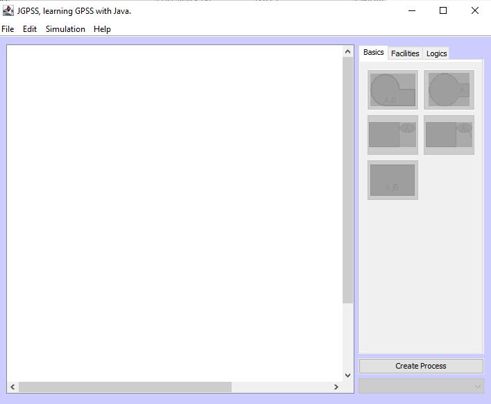

# gpssh-system-simulation

16-bit Windows, Python and Java Implementation with Several Examples for GPSS/H

## 16-bit GPSS/H Usage (gpss_dos)

- Install DOSBOX, Download from [Repository](tools/DOSBox0.74-3-win32-installer.exe)

- MOUNT cloned repository directory to DOSBOX as follow

```bash
Z:\>MOUNT C C:\C:\Users\ugur.coruh\Desktop\gpssh-system-simulation
```

- Write C and Change Directory use CD command to access GPSSH.EXE in gpssh_dos folder and also copy  GPS example files to current location and run to generate LIS reports

```bash
C:\GPSS_DOS\GPSSH.EXE EXAMPLE.GPS
```

- Open LIS file and interpret results

## Python Version Usage (gpss_python)

Reference : [GitHub - martendo/gpss.py: A Python implementation of IBM&#39;s General Purpose Simulation System](https://github.com/martendo/gpss.py)

[gpss.py Usage](https://martendo.github.io/gpss.py/usage#functions-parse)

From the Command Line

```
python3 -m gpss [-S] [-d] [-o outfile] infile
```

On Windows, use `py -3` instead of `python3`.

### Arguments

- `infile`  
  Your GPSS program. Required.
- `-o outfile`/`--output outfile`  
  File to write the simulation report to, instead of stdout. Optional.
- `-S`/`--no-sim` (switch)  
  Don't run the simulation, but still pass it through the parser and check
  for syntax errors.
- `-d`/`--debug` (switch)  
  Print debug messages.

Also:

- `--version`  
  Print gpss.py's version number and exit.
- `-h`/`--help`  
  Print program usage and argument descriptions.

## gpss.py as a Package

gpss.py can be imported into another script as the `gpss` module.

```python
import gpss

gpss.run("examples/barber.gps")
print(gpss.createReport())
```

### Functions

#### `gpss.parse(infile=None, program=None)`

Parse a gpss.py program from file `infile` or string `program`.

The parser used can be accessed through `gpss.parser`, and its error
count through `gpss.parser.error_count`.

#### `gpss.run(infile=None, program=None)`

Run a simulation. If specified, file `infile` or string `program` will
be parsed with [`gpss.parse()`](#functions-parse) before running the
simulation. Otherwise, the program last parsed will be used.

A `gpss.SimulationError` will be raised if anything illegal occurs in
the simulation.

#### `gpss.createReport()`

Return a master simulation report. Contained within are all the
simulation reports returned by [`gpss.getReports()`](#functions-getReports).

#### `gpss.getReports()`

Return a list of reports from each run in the simulation.

## Java Version (gpssh_java)



## References

- [GPSS - Wikipedia](https://en.wikipedia.org/wiki/GPSS)

- [Simulation using gpss/h introduction to gpss/h march 2009 THE gpss/h world view](https://genderi.org/simulation-using-gpssh-introduction-to-gpssh-march-2009-the-gp.html) 

- [JGPSS executable &mdash; Java General Purpose Simulation System. JGPSS &mdash; UPC. Universitat Politècnica de Catalunya](https://jgpss.liam.upc.edu/en/downloads/jgpss.jar/view)

- https://github.com/DimaOrdenov/gpss-python.git
